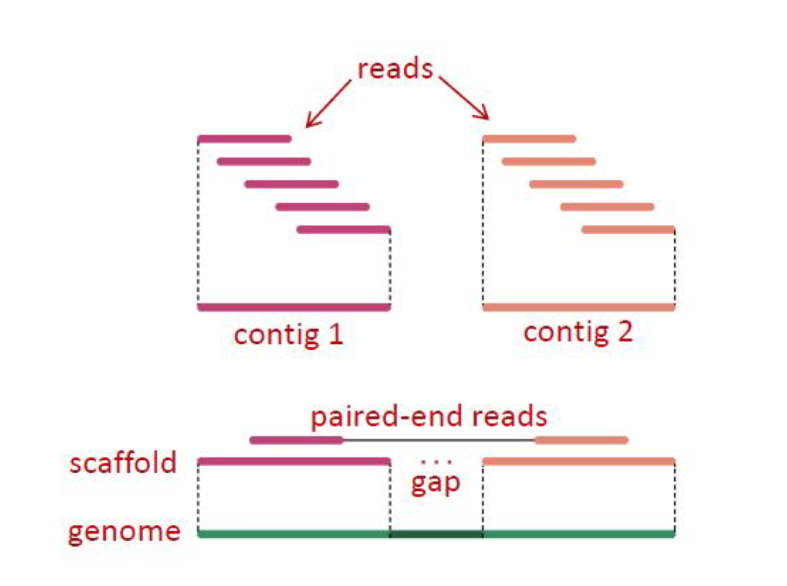

# VEME 2023 NGS *De novo* Assembly Tutorial

## Taylor K. Paisie
### `https://taylorpaisie.github.io/VEME_2023_NGS_Denovo_assembly/`

### 1. Introduction to sequence assembly
#### What does "sequence assembly" mean?
#### Assembly is a “catch-all” term used to describe methods where we combine shorter individual measurements called reads into longer contiguous sequences typically called contigs
#### Because the sequencing process works by breaking the original DNA into smaller fragments, the assembly process is conceptually similar to putting together an image puzzle from its many pieces
#### The software that performs the assembly is called the assembler.
#### We will learn how to *de novo* assemble reads obtained with the Illumina sequencing platform using [SPAdes](http://cab.spbu.ru/software/spades/), an assembly toolkit containing various assembly pipelines

#### *De novo* assembly usually includes the following steps:  
1) Improving of the reads quality (remove adapters, trim reads, etc.)
2) De novo assembly of the overlapping reads into contigs
3) Joining contigs into scaffolds
4) Comparison with other known genomes
5) Filling the gaps
6) Verification of the assembled genome
7) Annotation of the assembled genome

#### Challenges of *de novo* assembly
#### Sequence assembly is perhaps the application domain of bioinformatics where skill and expertise are the most difficult to identify and define   
#### Assemblers are quite unlike any other software tool you will ever use. Most come with a bewildering array of parameters - the purpose of which are not explained, yet many will have profound effects on the results that they produce  

#### Trial and error are one of the most commonly used strategies - you will have to keep tuning the parameters and rerun the entire process hoping that the results improve - sometimes in vain  
#### As it turns out, genome assembly is the most computational demanding bioinformatics method of them all  
#### Assembling a large genome may take even weeks(!) and substantial computational resources  
#### Thus any expertise built on trial and error will have to be accumulated over a much more extended period  
#### Finally, even when assembly appears to work, almost always it will contain several severe and substantial errors. That is where, in our opinion, bioinformatics expertise matters more  
#### The ability to understand, visualize and correct the mistakes of an assembly has a utility that will outlast the present and is more valuable than knowing the exact invocation of a tool by heart  

<figure>
    
    <figcaption>Overlapping reads are assembled into contigs. Based on the info about paired-end reads, contigs may be further assembled into scaffolds</figcaption>
</figure>

### 2. Trimming Fastq files  

1. Running Trimmomatic on bacteriophage fastq files:  

`$ trimmomatic PE 169_S7_L001_R1_001.fastq.gz  169_S7_L001_R2_001.fastq.gz \  
169_S7_L001_R1_001.trim.fastq.gz 169_S7_L001_R1_001un.trim.fastq.gz \  
169_S7_L001_R2_001.trim.fastq.gz 169_S7_L001_R2_001un.trim.fastq.gz \  
SLIDINGWINDOW:4:20 MINLEN:25 ILLUMINACLIP:NexteraPE-PE.fa:2:40:15`  

2. Running FastQC on newly trimmed fastq files:  

`$ fastqc *trim.fastq.gz`  

### 3. Sequence Assembly

#### We will be using the program [SPades](http://cab.spbu.ru/software/spades/) for *de novo* assembly  

