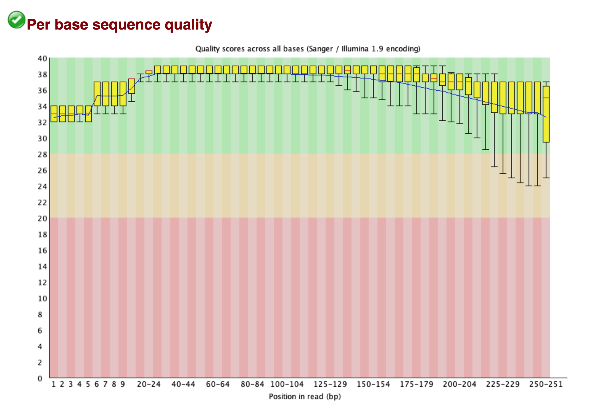
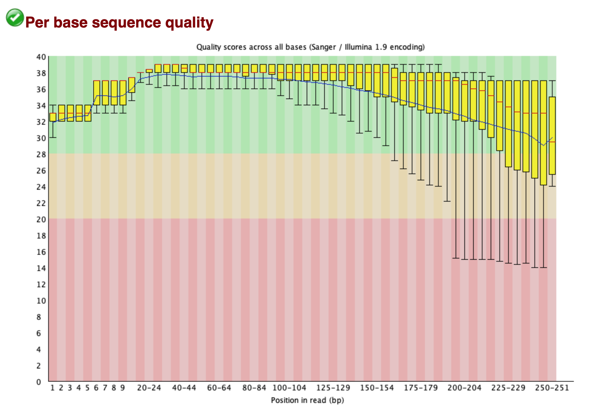
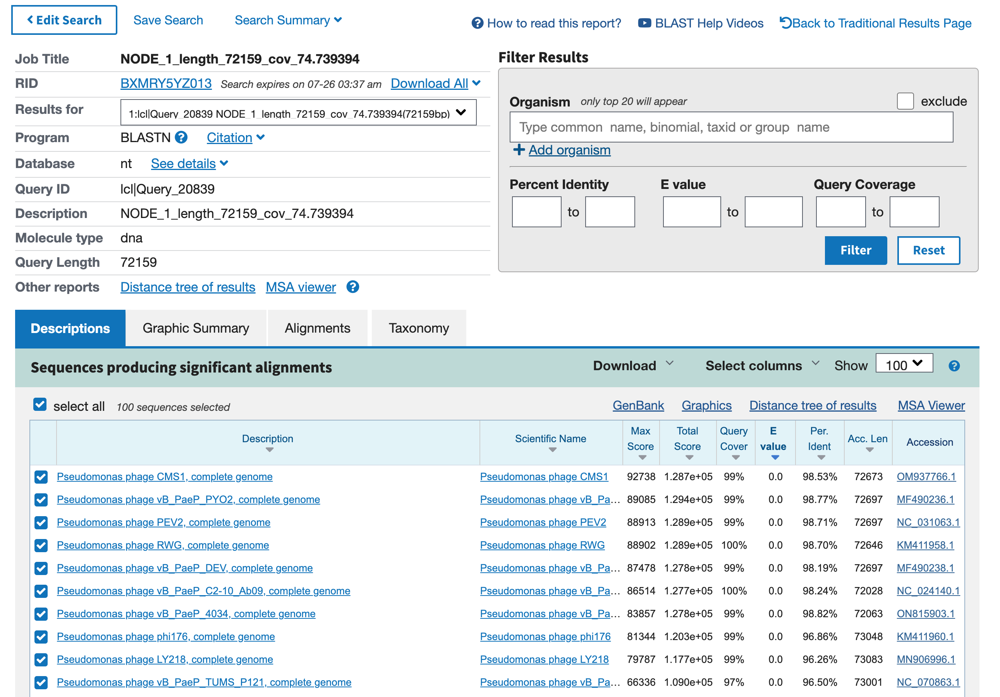
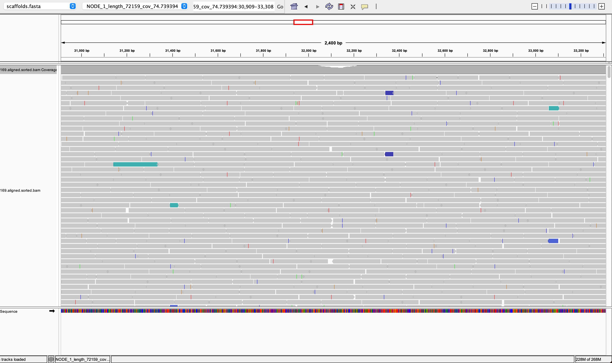
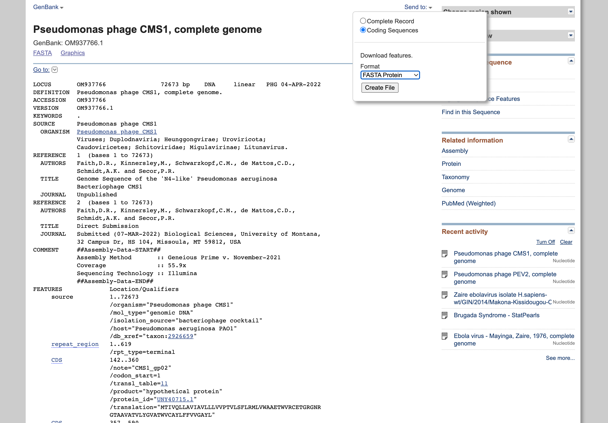

# VEME 2023 NGS *De novo* Assembly Tutorial

## Taylor K. Paisie
### `https://taylorpaisie.github.io/VEME_2023_NGS_Denovo_assembly/`

#### Directory visualization
<figure>
    
    <figcaption>How the structure of our directories should look</figcaption>
</figure>

### 1. Introduction to sequence assembly
#### What does "sequence assembly" mean?
#### Assembly is a “catch-all” term used to describe methods where we combine shorter individual reads into longer contiguous sequences called contigs
#### Because the sequencing process works by breaking the original DNA into smaller fragments, the assembly process is conceptually similar to putting together an image puzzle from its many pieces
#### The software that performs the assembly is called the assembler  
#### We will learn how to *de novo* assemble reads sequenced by the Illumina sequencing platform using [SPAdes](http://cab.spbu.ru/software/spades/), an assembly toolkit containing various assembly pipelines

#### *De novo* assembly usually includes the following steps:  
1. Improving of the reads quality (remove adapters, trim reads, etc..)  
2. De novo assembly of the overlapping reads into contigs
3. Joining contigs into scaffolds
4. Comparison with other known genomes
5. Filling the gaps
6. Annotation of the assembled genome
7. Visualize genome annotation  

#### Challenges of *de novo* assembly
#### Sequence assembly is perhaps the application domain of bioinformatics where skill and expertise are the most difficult to identify and define   
#### Assemblers are quite unlike any other software tool you will ever use  
#### Most come with a bewildering array of parameters - the purpose of which are not explained, yet many will have profound effects on the results that they produce  
#### Trial and error are one of the most commonly used strategies - you will have to keep tuning the parameters and rerun the entire process hoping that the results improve  
#### Assembling a large genome may take weeks and substantial computational resources  
#### Thus any expertise built on trial and error will have to be accumulated over a much more extended period  
#### Finally, even when assembly appears to work, almost always it will contain several severe and substantial errors. That is where, in our opinion, bioinformatics expertise matters more  
#### The ability to understand, visualize and correct the mistakes of an assembly has a utility that will outlast the present and is more valuable than knowing the exact invocation of a tool by heart  
#### N50: length for which the collection of all contigs of that length or longer covers at least 50% of assembly length  

<figure>
    
    <figcaption>Overlapping reads are assembled into contigs. Based on the info about paired-end reads, contigs may be further assembled into scaffolds</figcaption>
</figure>

#### Multidrug resistant bacteria have become a major public health threat. Phage therapy may to be used as an alternative to antibiotics or, as a supplementary approach to treat some bacterial infections   
#### Bacteriophages have been applied in clinical practice for the treatment of localized infections in wounds, burns, and trophic ulcers, including diabetic foot ulcers (PMC6083058)  
#### In this study, bacteria were collected from trophic ulcers of the patients  
#### Bacteriophages that were successful in treating diabetic foot disease were sequenced using NGS technology   
#### The sample we will be using is a 2x250 Illumina sequenced bacteriophage  
#### The goal of this exercise is to assemble the genome of a sequenced bacteriophage  

### 2. Trimming Fastq files  

#### First we will run FastQC on the raw fastq files:  

`$ fastqc *.fastq.gz`

#### Now run Trimmomatic on the raw fastq files:  

`$ trimmomatic PE 169_S7_L001_R1_001.fastq.gz  169_S7_L001_R2_001.fastq.gz \`  
`169_S7_L001_R1_001.trim.fastq.gz 169_S7_L001_R1_001un.trim.fastq.gz \`  
`169_S7_L001_R2_001.trim.fastq.gz 169_S7_L001_R2_001un.trim.fastq.gz \`  
`SLIDINGWINDOW:4:20 MINLEN:25 ILLUMINACLIP:TruSeq3-PE-2.fa:2:40:15`  

#### Run FastQC on newly trimmed fastq files:  

`$ fastqc *trim.fastq.gz`  

<figure>
    
    <figcaption>FastQC graph output for trimmed forward reads</figcaption>
</figure>

<figure>
    
    <figcaption>FastQC graph output for trimmed reverse reads</figcaption>
</figure>

### 3. Sequence Assembly

#### We will be using the program [SPades](http://cab.spbu.ru/software/spades/) for *de novo* assembly  

#### Spades will automatically make the final scaffolds:  

`$ spades.py -k 21,33,55,77,99,127 --isolate -1 169_S7_L001_R1_001.trim.fastq.gz \`  
`-2 169_S7_L001_R2_001.trim.fastq.gz -o spades_output`   

`ls -l spades_output`  

#### Notice in our `spades_output` directory we have both a `contigs.fasta` and a `scaffolds.fasta`  

#### SPades makes both files, but we will be using the `scaffolds.fasta` for this exercise

#### Create and move scaffolds from SPades to results directory:  

`$ mkdir -p results/scaffolds`  
`$ mv spades_output/scaffolds.fasta ../../results/scaffolds`  
`$ cd ../..`  

#### We now want to be at the `denovo_assembly` directory

### 4. Comparing the scaffolds to other known genomes

#### We will know take our scaffolds and use [NCBI BLAST](https://blast.ncbi.nlm.nih.gov/Blast.cgi) to compare our newly assembled genome to other genomes  

<figure>
    
    <figcaption>BLAST results from our scaffolds</figcaption>
</figure>

#### BLAST found similar genomes  
#### The closest is Pseudomonas phage CMS1, complete genome (OM937766.1), with coverage of 99% and identity of 98.53%   
#### Examination of the GenBank record for OM937766 finds that organism is "Pseudomonas phage CMS1" and the taxon ID is 2926659  
#### Another closely related genome is RefSeq NC_031063.1, Pseudomonas phage PEV2  

### 5. Filling the gaps  

#### Now we will take our scaffolds and use it as a reference as a 
#### Map the reads back to the scaffold as reference  
#### Set up BWA reference mapping with the scaffold `scaffold.fasta` as reference and add the trimmed fastq files  

#### Index our `scaffold.fasta` file we made with SPades:  

`$ bwa index scaffold.fasta`  

#### Run BWA-MEM reference mapping with the indexed `scaffold.fasta` as the reference and the original trimmed fastq files as the reads:  
`$ bwa mem results/scaffolds/scaffolds.fasta \`  
`data/trimmed_fastq/169_S7_L001_R1_001.trim.fastq.gz \`   
`data/trimmed_fastq/169_S7_L001_R2_001.trim.fastq.gz > results/sam/169.aligned.sam`    

#### Convert SAM file to BAM format:  
`$ samtools view -S -b results/sam/169.aligned.sam > results/bam/169.aligned.bam`  

#### Sort BAM file by coordinates:  
`$ samtools sort -o results/bam/169.aligned.sorted.bam results/bam/169.aligned.bam`  

#### Index new sorted BAM file:  
`$ samtools index results/bam/169.aligned.sorted.bam`  

#### Visualizing our new BAM file with IGV
#### We will use our `scaffolds.fasta` as the reference genome in IGV and the `169.aligned.sorted.bam` BAM file

<figure>
    
    <figcaption>IGV visualization of our genome assembly</figcaption>
</figure>

#### Now we run the program [Pilon](https://github.com/broadinstitute/pilon)

#### Pilon is a software tool which can be used to automatically improve draft assemblies  
#### It attempts to make improvements to the input genome, including:  
    * Single base differences  
    * Small Indels  
    * Larger Indels or block substitution events  
    * Gap filling
    * Identification of local misassemblies, including optional opening of new gaps

#### Pilon outputs a FASTA file containing an improved representation of the genome from the read data  

`$ pilon --genome scaffolds/scaffolds.fasta --frags bam/169.aligned.sorted.bam --output 169_improved`  

#### This command will give us the file `169_improved.fasta`  

#### After running this commmand, each fasta input in `169_improved.fasta` has `_pilon`
#### We want to remove this `_pilon` after each fasta input
#### Open `169_improved.fasta` in a text editor
#### We want to "replace all" `_pilon` with nothing

<figure>
    
    <figcaption>How to edit the improved fasta file</figcaption>
</figure>

### 6. Annotation of the assembled genome

#### We will use [PROKKA](https://github.com/tseemann/prokka) on the improved sequence assembly

#### After you have *de novo* assembled your genome sequencing reads into scaffolds, it is useful to know what genomic features are on those contigs  
#### The process of identifying and labelling those features is called genome annotation  
#### Prokka is a "wrapper"; it collects together several pieces of software (from various authors), and so avoids "re-inventing the wheel"  
#### Prokka finds and annotates features (both protein coding regions and RNA genes, i.e. tRNA, rRNA) present on on a sequence  
#### Prokka uses a two-step process for the annotation of protein coding regions:  
    1. Protein coding regions on the genome are identified using Prodigal  
    2. The function of the encoded protein is predicted by similarity to proteins in one of many protein or protein domain databases  
#### Prokka is a software tool that can be used to annotate bacterial, archaeal and viral genomes quickly, generating standard output files in GenBank, EMBL and gff formats

#### Once Prokka has finished, examine each of its output files:
    * The GFF and GBK files contain all of the information about the features annotated (in different formats)  
    * The .txt file contains a summary of the number of features annotated  
    * The .faa file contains the protein sequences of the genes annotated  
    * The .ffn file contains the nucleotide sequences of the genes annotated  

#### We will use a protein set specific to Pseudomonas phage PEV2 (NC_031063.1), our closely related genome from BLAST, for the annotation

#### First we want to download the [protein coding regions of the Pseudomonas phage PEV2 (NC_031063.1) genome](https://www.ncbi.nlm.nih.gov/nuccore/NC_031063.1), we can do this from NCBI

<figure>
    
    <figcaption>How to download a set of proteins from NCBI</figcaption>
</figure>

#### Running prokka on the improved alignment with our downloaded protein set for annotation:  

`$ cd results/`  

`$ prokka --outdir prokka_output --kingdom Viruses \`  
`--proteins annotation/NC_031063.1.faa 169_improved.fasta`  

### 7. Visualize genome annotation

#### We will use the program Artemis to visualize the genome annotation we made with PROKKA using [Artemis](https://sanger-pathogens.github.io/Artemis/Artemis/) 
#### Artemis is a free genome browser and annotation tool that allows visualisation of sequence features, next generation data and the results of analyses within the context of the sequence, and also its six-frame translation  
#### Artemis is written in Java, and is available for UNIX, Macintosh and Windows systems  
#### It can read EMBL and GENBANK database entries or sequence in FASTA, indexed FASTA or raw format  
#### Using the GFF file made from PROKKA, we will open it with Artemis:  

`$  art prokka_output/PROKKA_07242023.gff`  

<figure>
    
    <figcaption>Visualizaing the genome annotation with Artemis</figcaption>
</figure>

#### Some tips for using Artemis:

1. There are 3 panels: feature map (top), sequence (middle), feature list (bottom)
2. Click right-mouse-button on bottom panel and select Show products
3. Zooming is done via the verrtical scroll bars in the two top panels

